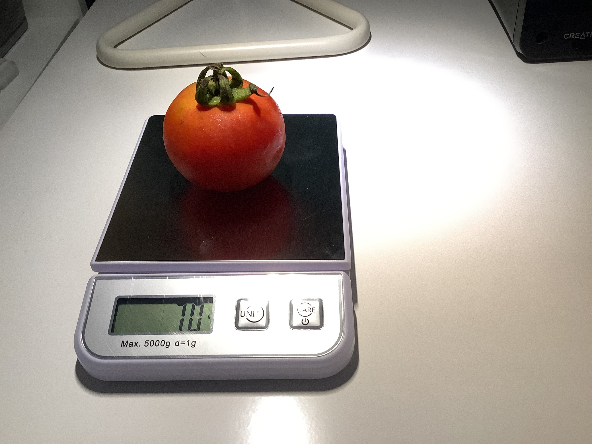
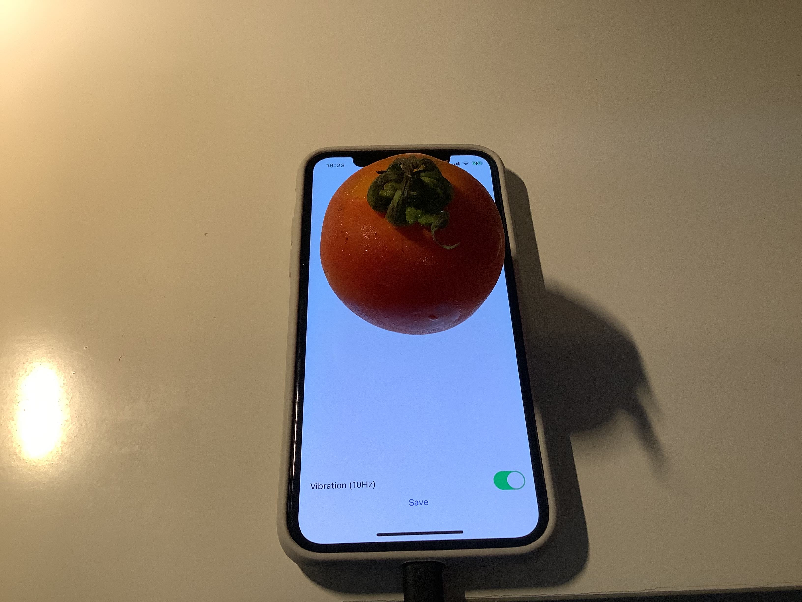
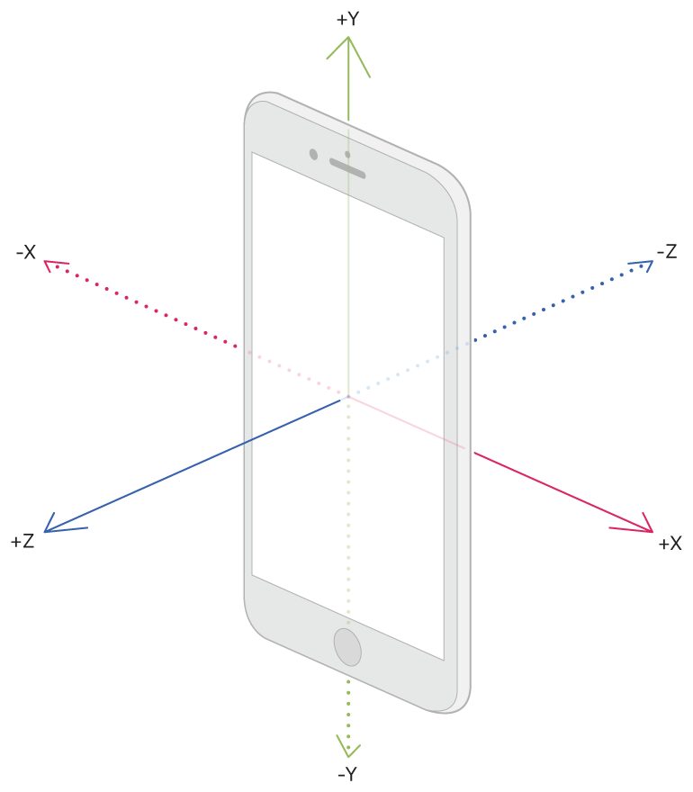

# Accelerometer data with different objects placed on a vibrating iPhone

## Hardware

An Apple iPhone X with a silicone case placed on a wooden IKEA desk is used. Battery is at 100% and connected to power when the data is captured.

## Software

Accelerometer data are captured using Apple's CoreMotion API on iOS 16.3.1. The data is captured at 100Hz for 10 seconds.

During the capture, the phone's vibration motor is called at 10Hz with `heavy` intensity.

The capturing source code can be found in `ContentView.swift`.

## Data

The data is stored in `XXg_XXXX/{UUID}.csv`. Each csv file in a folder represents one trial. Inside the csv files, each line represents the acceleration along the x, y, z axes respectively.

You can find the example Python code in `visualize.py`.

